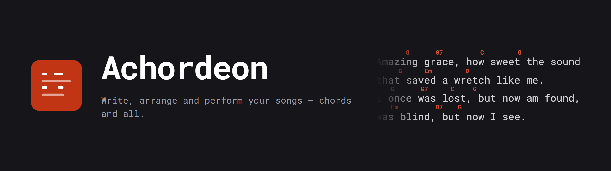
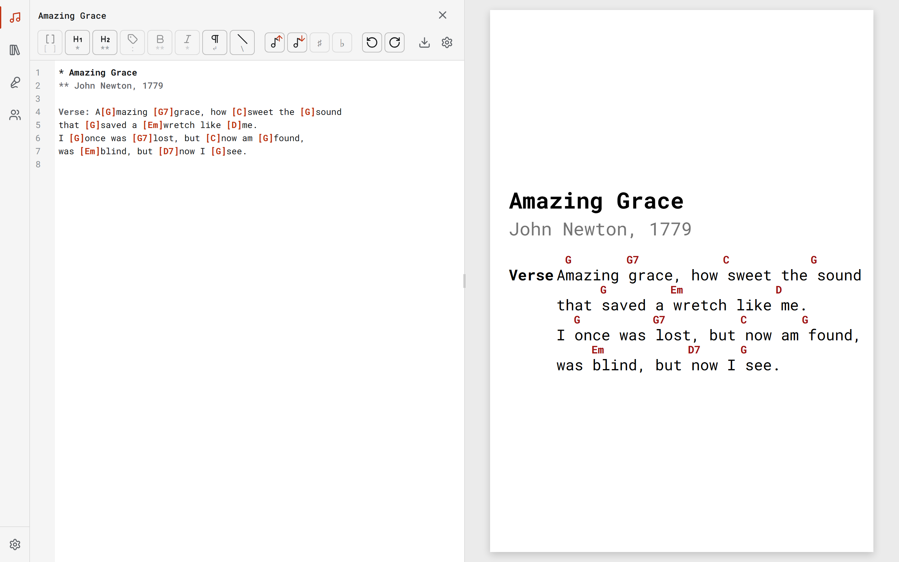
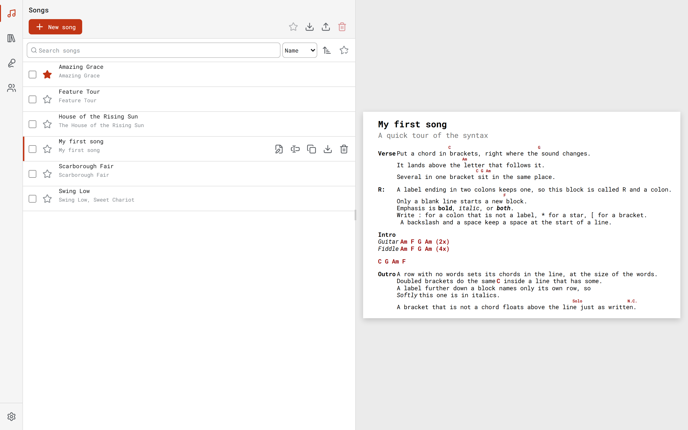

<p align="center">
  <a href="https://achordeon.eu">
    
  </a>
</p>

<p align="center">
  <b>A chord sheet editor and songbook that runs in your browser.</b><br />
  Write lyrics with the chords where you actually play them, bind the songs into
  songbooks, and perform them off a phone — offline, no account needed.
</p>

<p align="center">
  <a href="https://achordeon.eu/app/"><b>Launch the app</b></a> ·
  <a href="https://achordeon.eu/docs"><b>Documentation</b></a> ·
  <a href="https://achordeon.eu/docs/patch-notes">Patch notes</a> ·
  <a href="https://achordeon.eu/docs/songs/syntax">Syntax</a>
</p>

<p align="center">
  
  
  
</p>

---

## About

Achordeon came from a personal need: exporting several songs at once, in a
format that is actually readable, with the chords where they belong. Text
editors do not place chords over letters, and fighting them for every song is
not writing songs.

So the layout is not your job here. You write the words and put a chord in
brackets at the syllable where the sound changes — `A[G]mazing [G7]grace` — and
the renderer does the rest: the chord lands above the letter that follows it,
the sheet is spaced and sized, and the song fits **one page with no scrolling**.
Picture a performer at a campfire, reading off a phone while holding a guitar.
That is the target.

The library lives in your browser, on your device. There is no account to make,
nothing to sync, and nothing to be online for. Sign in only if you want a backup
in Google Drive or the same library on a second device.

<p align="center">
  
</p>

## Features

**Songs** — Write in a small markup: a title, a subtitle, blocks of lyrics,
labels like `Verse:` or `R:`, and chords in square brackets. Emphasis, chord
rows without words, repeats. The render is beside the source while you type, and
it is what you will perform from. Transpose a song up or down; it is one button.
[Syntax reference →](https://achordeon.eu/docs/songs/syntax)

**Library** — Search by title or text (accent-insensitive: `svetlo` finds
`Světlo`), sort by name, date or favourites, tick rows in runs with `shift`.

**Songbooks** — An ordered list of songs, built by drag and drop or by buttons,
with the same song allowed more than once. Preview any row without leaving the
list.

**Stage & audience** — Perform straight from a songbook: one song per screen,
navigation and nothing else. Your audience can follow the same song on their own
phones by joining with a PIN.

**Export & import** — Take everything with you as an Achordeon JSON file — a
small, hand-editable database of songs and songbooks — or download a PDF for
playing, printing and sharing. Import puts it back.

**AI import** — Photograph a chord sheet, hand the photo to a chatbot with the
ready-made skill, get a file, import it. No retyping.
[Guide →](https://achordeon.eu/docs/guides/ai-import)

**Offline, installable** — A PWA with a service worker: install it, and it keeps
working with no connection at all. Dark and light themes, English and Czech.

<p align="center">
  
</p>

## Technical

An Nx monorepo holding both the product and its documentation site. Both deploy
to GitHub Pages from a single push to `main`.

**Stack** — Angular 21 with signals and `@ngrx/signals`, standalone components
and lazy routes. Dexie (IndexedDB) for the local library, `@angular/service-worker`
for offline, CodeMirror 6 for the editor, Tonal for chord theory, jsPDF for the
download. Supabase backs the audience lobbies, and nothing else. Docusaurus 3
for the docs. Jest for unit tests, Playwright for e2e.

The parser and renderer live in framework-free libraries under `libs/shared`, so
the docs site imports the real ones — the pictures in the documentation are
rendered by the same code the app runs.

### Layout

```
apps/
  app/      Angular application (the product)
  app-e2e/  Playwright end-to-end tests
  docs/     Docusaurus landing + docs site
libs/
  shared/   domain, render-core, chord-theory, editor-core, data-access
tools/      Workspace scripts
docs/       PRDs and architecture decision records (not published)
```

### Prerequisites

- Node.js 22 (see `.nvmrc`)
- pnpm 11+ (Corepack: `corepack enable && corepack prepare pnpm@latest --activate`)

### Quick start

```bash
pnpm install

pnpm dev:app    # Angular dev server  → http://localhost:4200
pnpm dev:docs   # Docusaurus dev server → http://localhost:3000

pnpm build      # Build both apps
pnpm lint       # Lint both apps
pnpm test       # Run unit tests
```

Prefer running tasks through Nx (`pnpm nx build app`, `pnpm nx run-many -t test`)
rather than the underlying tooling.

### URLs

GitHub Pages, served under the custom apex domain `achordeon.eu`:

| URL                               | Content       |
| --------------------------------- | ------------- |
| `https://achordeon.eu/`           | Landing page  |
| `https://achordeon.eu/docs/intro` | Documentation |
| `https://achordeon.eu/app/`       | Achordeon app |

The domain is claimed by `apps/docs/static/CNAME` (copied to the site root by the
Docusaurus build). DNS: apex `A`/`AAAA` records to GitHub's Pages IPs, `www`
`CNAME` to `dcniemandd.github.io`.

Where the two apps think they live comes from four variables — `DOCS_URL`,
`DOCS_BASE_URL`, `APP_BASE_HREF`, `APP_LINK`. In CI they are repo **variables**
(Settings ▸ Secrets and variables ▸ Actions ▸ Variables); the workflow falls back
to the values above when a variable is unset. Locally they are optional: Nx loads
`.env.local` into every task it runs, so uncommenting them in your `.env.local`
(see `.env.local.example`) reproduces a deploy build, and leaving them out gives
you the same paths from the defaults in `apps/docs/docusaurus.config.ts` and
`apps/app/project.json`.

### Deploying

Push to `main` triggers `.github/workflows/deploy.yml`:

1. **verify** — lint, test, build (runs on all branches + PRs).
2. **deploy** — only on push to `main`. Builds both apps with the env vars
   above, assembles `dist/site/`, copies `index.html` → `404.html` under
   `dist/site/app/` (SPA fallback for Angular's PathLocationStrategy on Pages),
   uploads as a Pages artifact, deploys.

Repo settings → Pages → Source must be set to **GitHub Actions**.

### Images in this README

The banner, the link-preview card and the screenshots above are generated, not
exported by hand:

```bash
node tools/gen-brand-images.mjs            # banner + og:image card
node tools/gen-brand-images.mjs --screens  # also the screenshots (needs pnpm dev:app)
```

## Contributing

Found a bug, or something wrong in the documentation?
[Open an issue](https://github.com/DcNiemandd/achordeon/issues).

## License

MIT — see [LICENSE](./LICENSE).
