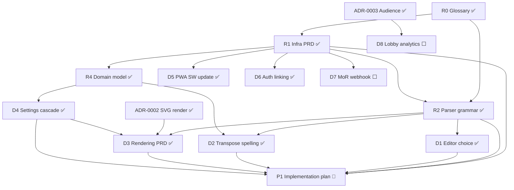

# Achordeon — Master PRD & Research Roadmap

The umbrella index over Achordeon's design docs and the **research/grilling
backlog**. Each row of work is grilled (skill: `grill-with-docs`) into its own
focused doc; decisions are recorded inline as ADRs or PRD sections. This file is the
map: what exists, what's open, and what blocks what.

Repo-root `docs/` — **not** the published Docusaurus site (`apps/docs/docs`).

---

## Document map

| Doc                                                | Role                                                                                                                                                                                                                                                                                                          |
| -------------------------------------------------- | ------------------------------------------------------------------------------------------------------------------------------------------------------------------------------------------------------------------------------------------------------------------------------------------------------------- |
| [`../CONTEXT.md`](../CONTEXT.md)                   | **Glossary** — ubiquitous language, source of truth for terms. Glossary only, no implementation.                                                                                                                                                                                                              |
| [`PRD-INFRASTRUCTURE.md`](./PRD-INFRASTRUCTURE.md) | Backend/infra PRD — services, state, persistence, sync, Drive, security, export/import/download, Audience, router, i18n, parser summary (§12).                                                                                                                                                                |
| [`PARSER-GRAMMAR.md`](./PARSER-GRAMMAR.md)         | Parser grammar spec — Phase 1/2 rules, chord sub-grammar, escapes, warnings, reparse.                                                                                                                                                                                                                         |
| [`PRD-DOMAIN-MODEL.md`](./PRD-DOMAIN-MODEL.md)     | `shared/domain` shapes — base record, Song (+ parser cache), Songbook + entries, settings registry/cascade.                                                                                                                                                                                                   |
| [`PRD-RENDERING.md`](./PRD-RENDERING.md)           | Rendering/visual layer — render pipeline + output seam, geometry requirements (scale-to-fit, columns, aspect ratio, title region, `labelInline` gutter, chord x-positioning, vertical rhythm, fonts), `RenderPlan` + `layout` signature, songbook page chrome. Requirements settled; implementation under P1. |
| `PRD-EDITOR.md` _(planned)_                        | Editor + authoring — chosen editor, highlight grammar, insert buttons, markers.                                                                                                                                                                                                                               |
| [`adr/`](./adr/)                                   | Architecture Decision Records (0001–0010).                                                                                                                                                                                                                                                                    |
| [`../research/`](../research/)                     | Background research (sync backends; trust model & monetization).                                                                                                                                                                                                                                              |

**ADRs:** 0001 content-vs-settings · 0002 SVG render target · 0003 Audience over
Presence · 0004 handoff-not-concurrent sync · 0005 pure two-phase parser · 0006
data-driven settings cascade · 0007 schema versioning & migration · 0008 chord-theory
port · 0009 add-method auth linking & Drive-on-Google · 0010 CodeMirror 6 editor,
loosely coupled.

---

## Scopes (architecture map)

The app decomposes **vertically** into _features_ (Nx `scope` tags) over a **shared**
floor, each cut into _layers_ (Nx `type`: feature / ui / data-access / domain / util).
"Module" is informal UX-speak for a nav area; the precise unit is a **feature**.

- **`shared`** — the dependency floor every feature imports. `shared/domain` (types,
  settings registry, `resolveSettings`, `transposeContent`, `ChordTheory` port),
  `shared/data-access` (Dexie persistence, stores, sync, auth, `TonalChordTheory`), and
  **rendering** — the SVG `RenderService` is **shared**, consumed by songs preview,
  stage, audience, and download. [floor settled; rendering grill = D3]
- **`songs`** — song explorer + the **editor** (the editor lives in the **song scope**,
  not shared). [editor scope decided]
- **`songbooks`**, **`stage`**, **`audience`**, **`settings`** — the remaining feature
  verticals (per router, `PRD-INFRASTRUCTURE.md` §10).

## Status legend

✅ done · 🔵 in progress · ⬜ open · 🔮 future

---

## Research / design backlog

### Done

| ID  | Task                                                                                                                     | Where                               |
| --- | ------------------------------------------------------------------------------------------------------------------------ | ----------------------------------- |
| R0  | Domain glossary                                                                                                          | `CONTEXT.md` ✅                     |
| R1  | Infrastructure PRD (services, state, persistence, sync, Drive, security, export/import/download, Audience, router, i18n) | `PRD-INFRASTRUCTURE.md` ✅          |
| R2  | Parser grammar / tokenizer                                                                                               | `PARSER-GRAMMAR.md` ✅              |
| R3  | ADRs 0001–0008                                                                                                           | `adr/` ✅                           |
| R4  | **Shared domain model** — base record, Song (+ parser cache), Songbook + entries, settings registry/cascade              | `PRD-DOMAIN-MODEL.md` ✅            |
| R5  | **Schema versioning & migration** — `schemaVersion`, forward-only chain, preserve-unknown, refuse-on-newer               | `PRD-DOMAIN-MODEL.md` + ADR-0007 ✅ |

### Open — design / grilling

| ID  | Task                                                                                                                                                                                                   | Status | Target doc                               | Depends on   |
| --- | ------------------------------------------------------------------------------------------------------------------------------------------------------------------------------------------------------ | ------ | ---------------------------------------- | ------------ |
| D1  | **Editor choice** — CodeMirror 6, behind a loose-coupling seam; **song scope**                                                                                                                         | ✅     | ADR-0010 (+ `PRD-EDITOR.md` planned)     | R2           |
| D2  | **Transpose spelling** — chroma + fixed direction tables; `ChordTheory` port; key-aware future                                                                                                         | ✅     | `PRD-DOMAIN-MODEL.md` + ADR-0008         | R2, R4       |
| D3  | **Rendering PRD** (**shared** scope) — SVG layout, columns, scale-to-fit, aspect ratio, title region, `labelInline` gutter, chord x-positioning, vertical rhythm, fonts, `RenderPlan`, songbook chrome | ✅     | [`PRD-RENDERING.md`](./PRD-RENDERING.md) | R2, ADR-0002 |
| D4  | **Settings cascade** — Global→Songbook→Song, most-specific-wins, data-driven registry                                                                                                                  | ✅     | `PRD-DOMAIN-MODEL.md` + ADR-0006         | R1, R4       |
| D5  | **PWA service-worker update strategy** — `@angular/service-worker`, precache shell, gentle update prompt + blocking ADR-0007 refuse-prompt                                                             | ✅     | `PRD-INFRASTRUCTURE.md` §11              | R1, ADR-0007 |
| D6  | **Auth provider-linking** — link Google + email/password to one Account                                                                                                                                | ✅     | `PRD-INFRASTRUCTURE.md` §5               | R1           |
| D7  | **MoR webhook → Edge Function** — lifetime checkout → `profiles.plan`; Drive token-broker (Flow B)                                                                                                     | ⬜     | `PRD-INFRASTRUCTURE.md` §5/§6            | R1, research |
| D8  | **Lobby analytics** — retention window + aggregation detail                                                                                                                                            | ⬜     | `PRD-INFRASTRUCTURE.md` §9               | ADR-0003     |
| D9  | **Audience local transpose** — viewer transposes own copy; scope qs ("all songs?" / "remember per lobby+song?")                                                                                        | 🔮     | TBD                                      | ADR-0003     |

### Then — build

| ID  | Task                                                                           | Status | Target   | Depends on             |
| --- | ------------------------------------------------------------------------------ | ------ | -------- | ---------------------- |
| P1  | **Implementation plan** — tracer-bullet vertical slices (skill: `prd-to-plan`) | 🔮     | `plans/` | R1, R2, D3 (UI slices) |

---

## Future / icebox (non-v1)

Deferred features surfaced during grilling. **Not** v1 scope — kept here as a todo so
they aren't lost. Each points at where it was discussed. (D9 is tracked as a backlog row
above; the rest are feature notes, not grills.)

### Account / sync

- [ ] **Concurrent multi-device sync + live Realtime cross-device updates** (`subscribe`) —
      v1 is handoff-only LWW. Future premium upgrade. (`PRD-INFRASTRUCTURE.md` §5, ADR-0004)
- [ ] **In-app account merge** — merge two already-populated accounts (row re-keying +
      conflict resolution). v1 escape hatch is Export→Import. (§5, D6)
- [ ] **Unlink a sign-in method** (`unlinkIdentity`) — v1 is add-only; unlinking Google
      would also break Drive. (§5, D6)
- [ ] **Passwordless / magic-link login** — alternative to email+password. (§5, D6)
- [ ] **Drive token-broker (Flow B)** — Edge Function holding the `provider_refresh_token`
      server-side → silent, no-redirect Drive token. Same function the paid tier needs. (§6)
- [ ] **"Empty trash"** — ever purge tombstoned rows. v1 default: tombstones live forever. (§1)

### Rendering / output

- [ ] **Vector PDF straight from SVG** (e.g. svg2pdf.js) + user-chosen raster-vs-vector
      pipeline. v1 PDF is raster (PNG embedded). (§8)
- [ ] **Scrolling / multi-page for over-long songs** — v1 model is one-song-one-page. (`CONTEXT.md`)
- [ ] **Columns smart auto-fit** — v1 columns are author-set. (`CONTEXT.md`)
- [ ] **Key-aware transpose spelling** — v1 is direction-based (up→sharps, down→flats).
      (`CONTEXT.md`, D2, ADR-0008)

### Audience

- [ ] **Lobby host reload-resilience** — v1 drops the lobby on host reload → re-host. (§9)
- [ ] **Audience over local network** (LAN PWA, no internet) — open question; Bluetooth/
      hotspot not feasible. (`CONTEXT.md`)
- [ ] **D9 Audience local transpose** — viewer transposes own copy (tracked as backlog row). (D9)

### Security / QOL

- [ ] **Optional passphrase encryption-at-rest** — opt-in; breaks the visible-JSON backup,
      doesn't stop live XSS. (§7)
- [ ] **Re-import of Downloaded files** (embedded metadata) — nice-to-have, may be dropped
      if costly. (`CONTEXT.md`)

---

## Dependency graph

---

## Critical path & sequencing

- **R2 (parser) is done**, which unblocks **D1, D2, D3** — the parser was the
  keystone for the editor, transpose, and rendering work.
- **D3 (Rendering PRD) is settled** — pipeline + output seam, the full geometry
  requirements, `RenderPlan` + `layout` signature, and songbook page chrome are
  recorded in `PRD-RENDERING.md` (some §4 magnitudes flagged tunable). It built on
  the parser AST + ADR-0002 and **D4 (settings cascade)**. Remaining rendering work is
  implementation under **P1**, gated by the §3 svg2pdf spike (the one open guardrail).
- **D5–D8** are independent of the parser/render line. **D5 (PWA SW update) is now
  settled** (`@angular/service-worker`, §11). The rest can be grilled in any order once
  needed (D7 leans on the monetization research).
- **P1 (implementation plan)** waits on the core design — at minimum R1 + R2, plus D3
  before vertical slices touch the visual layer.

## Grilling backlog — by scope

A scope-oriented lens over the same backlog (the tables above order by dependency; this
orders by **Nx `scope`**). **The `shared` core floor is decided** — remaining grills are
feature-scoped or shared plumbing. Feature _UX_ that's already pinned in `CONTEXT.md` +
`PRD-INFRASTRUCTURE.md` (R1) does **not** need its own grill; it flows into **P1**
implementation slices. Grill a feature only when a **hard design question** surfaces.

- **`shared` (core floor) — ✅ DECIDED.** domain model (R4) · settings cascade (D4) ·
  transpose (D2) · rendering (D3) · parser grammar (R2) · schema/migration (R5). No grills
  remain on the floor.

- **`shared` plumbing / infra (cross-cutting) — open:**
  - ✅ **D5** PWA service-worker update strategy → `@angular/service-worker` (ngsw),
    precache the shell, gentle dismissible update prompt + **blocking** ADR-0007
    refuse-on-newer prompt. `PRD-INFRASTRUCTURE.md` §11.
  - ✅ **D6** Auth provider-linking (Google + email/password → one Account). Add-method-only
    (no account merge), email confirmation required, Drive rides on the Google identity.
    ADR-0009 + `PRD-INFRASTRUCTURE.md` §5.
  - ⬜ **D7** MoR webhook → Edge Function (lifetime checkout → `profiles.plan`; Drive
    token-broker). Leans on the monetization research.

- **`songs` scope — open:**
  - ✅ **D1** Editor choice → **CodeMirror 6**, behind a loose-coupling seam (ADR-0010).
    Monaco lost once author-familiarity proved false; CM6 wins on offline-PWA bundle,
    Angular-21 integration (no worker plumbing), and touch-readiness.
  - ⬜ **PRD-EDITOR.md** (after D1) — highlight grammar (CM6 stream parser), insert
    buttons, editor markers.
  - Song explorer UX → already specified (CONTEXT + R1) → **P1**, not a grill.

- **`audience` scope — open:**
  - ⬜ **D8** Lobby analytics (retention window + aggregation detail).
  - 🔮 **D9** Audience local transpose (future; scope questions unresolved).
  - Core audience (lobby/PIN/QR/sync/hide-chords) → specified (ADR-0003 + R1) → **P1**.

- **`songbooks` · `stage` · `settings` scopes — no open grills.** Behaviour is pinned in
  `CONTEXT.md` + R1 + the domain/rendering docs (songbook download chrome landed in
  `PRD-RENDERING.md` §6; the settings _model_ is D4/R4 — only the settings _GUI_ remains,
  and that's a **P1** UI slice). Grill only if a hard question appears while building.

- **build:** 🔮 **P1** implementation plan (`prd-to-plan`, tracer-bullet slices) — once the
  v1-relevant grills above are closed.

## How to use this file

1. Pick an open task. Run `grill-with-docs` into its **target doc**.
2. Record decisions inline; spin an ADR only when it's hard-to-reverse + surprising +
   a real trade-off.
3. Flip the task's status here and add any new links. Keep the graph in step.
