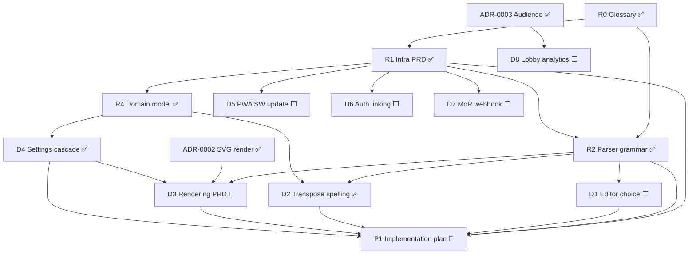

# Achordeon — Master PRD & Research Roadmap

The umbrella index over Achordeon's design docs and the **research/grilling
backlog**. Each row of work is grilled (skill: `grill-with-docs`) into its own
focused doc; decisions are recorded inline as ADRs or PRD sections. This file is the
map: what exists, what's open, and what blocks what.

Repo-root `docs/` — **not** the published Docusaurus site (`apps/docs/docs`).

---

## Document map

| Doc                                                | Role                                                                                                                                                               |
| -------------------------------------------------- | ------------------------------------------------------------------------------------------------------------------------------------------------------------------ |
| [`../CONTEXT.md`](../CONTEXT.md)                   | **Glossary** — ubiquitous language, source of truth for terms. Glossary only, no implementation.                                                                   |
| [`PRD-INFRASTRUCTURE.md`](./PRD-INFRASTRUCTURE.md) | Backend/infra PRD — services, state, persistence, sync, Drive, security, export/import/download, Audience, router, i18n, parser summary (§12).                     |
| [`PARSER-GRAMMAR.md`](./PARSER-GRAMMAR.md)         | Parser grammar spec — Phase 1/2 rules, chord sub-grammar, escapes, warnings, reparse.                                                                              |
| [`PRD-DOMAIN-MODEL.md`](./PRD-DOMAIN-MODEL.md)     | `shared/domain` shapes — base record, Song (+ parser cache), Songbook + entries, settings registry/cascade.                                                        |
| [`PRD-RENDERING.md`](./PRD-RENDERING.md)           | Rendering/visual layer — render pipeline + output seam (settled); SVG layout, columns, scale-to-fit, aspect ratio, `labelInline`, chord-only sizing (in progress). |
| `PRD-EDITOR.md` _(planned)_                        | Editor + authoring — chosen editor, highlight grammar, insert buttons, markers.                                                                                    |
| [`adr/`](./adr/)                                   | Architecture Decision Records (0001–0005).                                                                                                                         |
| [`../research/`](../research/)                     | Background research (sync backends; trust model & monetization).                                                                                                   |

**ADRs:** 0001 content-vs-settings · 0002 SVG render target · 0003 Audience over
Presence · 0004 handoff-not-concurrent sync · 0005 pure two-phase parser · 0006
data-driven settings cascade · 0007 schema versioning & migration · 0008 chord-theory
port.

---

## Scopes (architecture map)

The app decomposes **vertically** into _features_ (Nx `scope` tags) over a **shared**
floor, each cut into _layers_ (Nx `type`: feature / ui / data-access / domain / util).
"Module" is informal UX-speak for a nav area; the precise unit is a **feature**.

- **`shared`** — the dependency floor every feature imports. `shared/domain` (types,
  settings registry, `resolveSettings`, `transposeContent`, `ChordTheory` port),
  `shared/data-access` (Dexie persistence, stores, sync, auth, `TonalChordTheory`), and
  **rendering** — the SVG `RenderService` is **shared**, consumed by songs preview,
  stage, audience, and download. [floor settled; rendering grill = D3]
- **`songs`** — song explorer + the **editor** (the editor lives in the **song scope**,
  not shared). [editor scope decided]
- **`songbooks`**, **`stage`**, **`audience`**, **`settings`** — the remaining feature
  verticals (per router, `PRD-INFRASTRUCTURE.md` §10).

## Status legend

✅ done · 🔵 in progress · ⬜ open · 🔮 future

---

## Research / design backlog

### Done

| ID  | Task                                                                                                                     | Where                               |
| --- | ------------------------------------------------------------------------------------------------------------------------ | ----------------------------------- |
| R0  | Domain glossary                                                                                                          | `CONTEXT.md` ✅                     |
| R1  | Infrastructure PRD (services, state, persistence, sync, Drive, security, export/import/download, Audience, router, i18n) | `PRD-INFRASTRUCTURE.md` ✅          |
| R2  | Parser grammar / tokenizer                                                                                               | `PARSER-GRAMMAR.md` ✅              |
| R3  | ADRs 0001–0008                                                                                                           | `adr/` ✅                           |
| R4  | **Shared domain model** — base record, Song (+ parser cache), Songbook + entries, settings registry/cascade              | `PRD-DOMAIN-MODEL.md` ✅            |
| R5  | **Schema versioning & migration** — `schemaVersion`, forward-only chain, preserve-unknown, refuse-on-newer               | `PRD-DOMAIN-MODEL.md` + ADR-0007 ✅ |

### Open — design / grilling

| ID  | Task                                                                                                                                     | Status | Target doc                               | Depends on   |
| --- | ---------------------------------------------------------------------------------------------------------------------------------------- | ------ | ---------------------------------------- | ------------ |
| D1  | **Editor choice** (Monaco vs CodeMirror 6) — highlighting editor; **song scope**; likely an ADR                                          | ⬜     | ADR + `PRD-EDITOR.md`                    | R2           |
| D2  | **Transpose spelling** — chroma + fixed direction tables; `ChordTheory` port; key-aware future                                           | ✅     | `PRD-DOMAIN-MODEL.md` + ADR-0008         | R2, R4       |
| D3  | **Rendering PRD** (**shared** scope) — SVG layout, columns, scale-to-fit, aspect ratio, title position, `labelInline`, chord-only sizing | 🔵     | [`PRD-RENDERING.md`](./PRD-RENDERING.md) | R2, ADR-0002 |
| D4  | **Settings cascade** — Global→Songbook→Song, most-specific-wins, data-driven registry                                                    | ✅     | `PRD-DOMAIN-MODEL.md` + ADR-0006         | R1, R4       |
| D5  | **PWA service-worker update strategy** — precache, update prompt, offline; must deliver ADR-0007 refuse-prompt update                    | ⬜     | `PRD-INFRASTRUCTURE.md` §11              | R1, ADR-0007 |
| D6  | **Auth provider-linking** — link Google + email/password to one Account                                                                  | ⬜     | `PRD-INFRASTRUCTURE.md` §5               | R1           |
| D7  | **MoR webhook → Edge Function** — lifetime checkout → `profiles.plan`; Drive token-broker (Flow B)                                       | ⬜     | `PRD-INFRASTRUCTURE.md` §5/§6            | R1, research |
| D8  | **Lobby analytics** — retention window + aggregation detail                                                                              | ⬜     | `PRD-INFRASTRUCTURE.md` §9               | ADR-0003     |
| D9  | **Audience local transpose** — viewer transposes own copy; scope qs ("all songs?" / "remember per lobby+song?")                          | 🔮     | TBD                                      | ADR-0003     |

### Then — build

| ID  | Task                                                                           | Status | Target   | Depends on             |
| --- | ------------------------------------------------------------------------------ | ------ | -------- | ---------------------- |
| P1  | **Implementation plan** — tracer-bullet vertical slices (skill: `prd-to-plan`) | 🔮     | `plans/` | R1, R2, D3 (UI slices) |

---

## Dependency graph

---

## Critical path & sequencing

- **R2 (parser) is done**, which unblocks **D1, D2, D3** — the parser was the
  keystone for the editor, transpose, and rendering work.
- **D3 (Rendering PRD) is the next big rock.** It depends on the parser AST + ADR-0002
  and is fed by **D4 (settings cascade)**; grill D4 first (or alongside) so the
  render layer has its precedence model.
- **D5–D8** are independent of the parser/render line and can be grilled in any order
  once needed (D7 leans on the monetization research).
- **P1 (implementation plan)** waits on the core design — at minimum R1 + R2, plus D3
  before vertical slices touch the visual layer.

## How to use this file

1. Pick an open task. Run `grill-with-docs` into its **target doc**.
2. Record decisions inline; spin an ADR only when it's hard-to-reverse + surprising +
   a real trade-off.
3. Flip the task's status here and add any new links. Keep the graph in step.
